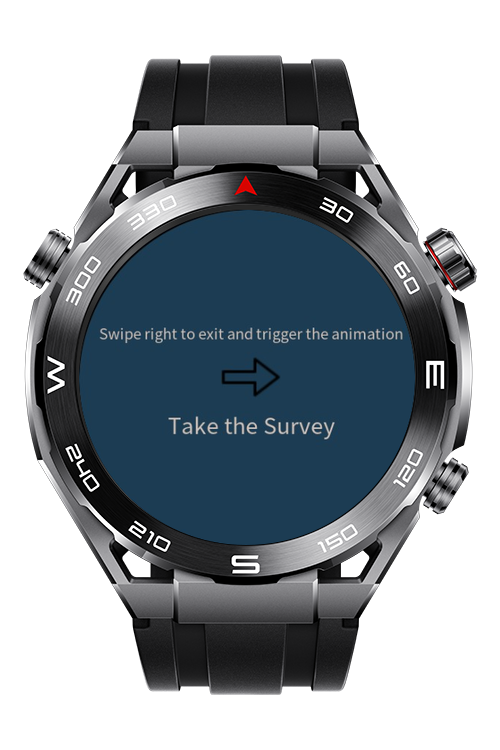
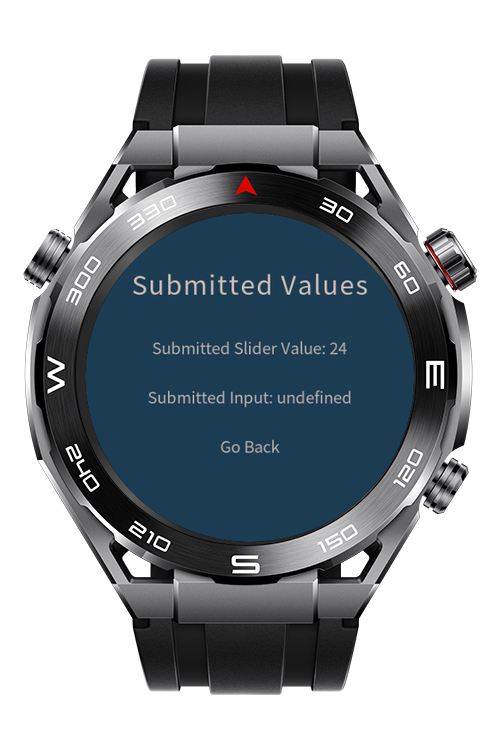

> **Note:** To access all shared projects, get information about environment setup, and view other guides, please visit [Explore-In-HMOS-Wearable Index](https://github.com/Explore-In-HMOS-Wearable/hmos-index).

# ExitAnimationApp

ExitAnimationApp is a demo application that replicates the native **exit app animation** available on Huawei Watch 5 and makes it usable on **Lite devices**.  
The animation is implemented using **@keyframes**, allowing a smooth and visually appealing exit transition effect.


# Preview

<p align="left">
  
  
  
  
</p>

---

# Use Cases

ExitAnimationApp allows users to:

- Experience the **watch 5-like exit animation** on Lite devices.
- Implement and customize **@keyframes-based animations** for page transitions.
- Understand how to apply exit app animation with Javascript in lite wearable devices

# Tech Stack

- **Languages:** Javascript
- **Frameworks:** HarmonyOS SDK 4.0.0(10)
- **Tools:** DevEco Studio Vers 5.1.1.840
- **Libraries:**  @ohos.router, @system.app

# Directory Structure

```

 src/main/js/MainAbility/pages/
   |---AnimationTestPage
   |   |---testAnimation.css                     // CSS File for test page
   |   |---testAnimation.hml                     // HML File for test page
   |   |---testAnimation.js                      // JS File for test page
   |---index
   |   |---index.css                             // CSS File for main page
   |   |---index.hml                             // HML File for main page
   |   |---index.js                              // JS File for main page
   |---Result
   |   |---result.css                            // CSS File for result page
   |   |---result.hml                            // HML File for result page
   |   |---result.js                             // JS File for result page
   |---Survey
   |   |---survey.css                            // CSS File for survey page
   |   |---survey.hml                            // HML File for survey page
   |   |---survey.js                             // JS File for survey page

```


# Constraints and Restrictions

## Supported Devices
-Huawei Sport (Lite) Watch GT 4/5/6
-Huawei Sport (Lite) GT4/5 Pro
-Huawei Sport (Lite) Fit 3/4
-Huawei Sport (Lite) D2
-Huawei Sport (Lite) Ultimate


# LICENSE

ExitAnimationApp is distributed under the terms of the MIT License.  
See the [LICENSE](/LICENSE) for more information.
